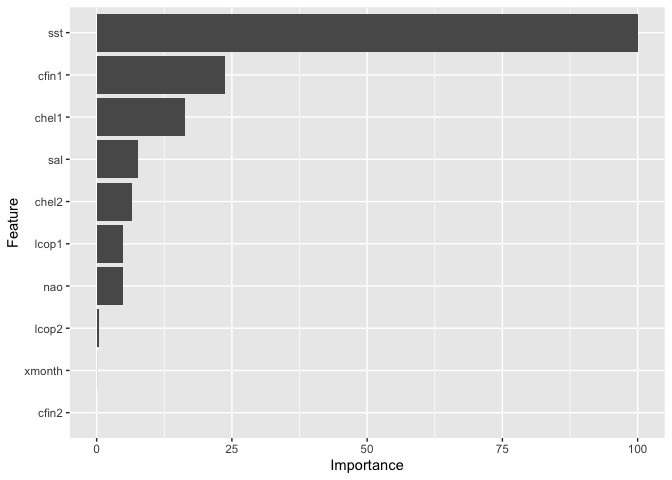

Podsumowanie analizy
====================

Przedmiotem analizy było określenie przyczyn zmniejszenia się długości
śledzi. Do dyspozycji mieliśmy ponad 52 tysięcy obserwacji dokonanych
podczas połowów. Każda obserwacja zawierała dane o stanie środowiska,
dostępności pokarmu i eksploatacji łowisk.

Przedstawiono podstawowe charakterystyki zbioru danych dotyczących
poszczególnych atrybutów i wyeliminowano obserwacje odstające. Następnie
uzupełniono brakujące dane korzystając z filtru Kalmana. Dysponując tak
przygotowanym zbiorem danych, sprawdzono korelację pomiędzy cechami.
Zauważono znaczny wpływ temperatury przy powierzchni wody na długość
śledzi.

Przeprowadzając dalszą analizę, przedstawiono zmiany w długości śledzi,
środowisku naturalnym oraz dostępności pokarmu. Określono moment w
czasie, od którego długość ryb uległa zmniejszeniu.

Ostatnim krokiem było przygotowanie trzech modeli regresji próbujących
przewidzieć długość śledzi. Modele zostały porównane ze sobą oraz
przedstawiono ich rozkład ważności atrybutów. Potwierdziło to hipotezę,
o zależności długości ryb od temperatury przy powierzchni wody.

Wykorzystane biblioteki
=======================

-   `knitr`
-   `kableExtra`
-   `dplyr`
-   `plotly`
-   `tidyverse`
-   `ggplot2`
-   `gridExtra`
-   `imputeTS`
-   `corrplot`
-   `reshape2`
-   `caret`
-   `gganimate`
-   `gifski`

Ustawienie ziarna generatora
============================

Celem zapewnienia powtarzalności operacji losowania, a co za tym idzie
powtarzalności wyników przy każdym uruchomieniu raportu na tych samych
danych, zastosowano ziarno generatora o wartości `102019`.

``` r
set.seed(102019)
```

Charakterystyka obserwacji - zastosowane atrybuty
=================================================

W ramach analizy mamy do czynienia z obserwacjami opisanymi za pomocą
następujących atrybutów:

-   **length**: długość złowionego śledzia \[cm\]
-   **cfin1**: dostępność planktonu \[zagęszczenie *Calanus
    finmarchicus* gat. 1\]
-   **cfin2**: dostępność planktonu \[zagęszczenie *Calanus
    finmarchicus* gat. 2\];
-   **chel1**: dostępność planktonu \[zagęszczenie *Calanus
    helgolandicus* gat. 1\];
-   **chel2**: dostępność planktonu \[zagęszczenie *Calanus
    helgolandicus* gat. 2\];
-   **lcop1**: dostępność planktonu \[zagęszczenie *widłonogów* gat.
    1\];
-   **lcop2**: dostępność planktonu \[zagęszczenie *widłonogów* gat.
    2\];
-   **fbar**: natężenie połowów w regionie \[ułamek pozostawionego
    narybku\];
-   **recr**: roczny narybek \[liczba śledzi\];
-   **cumf**: łączne roczne natężenie połowów w regionie \[ułamek
    pozostawionego narybku\];
-   **totaln**: łączna liczba ryb złowionych w ramach połowu \[liczba
    śledzi\];
-   **sst**: temperatura przy powierzchni wody \[°C\];
-   **sal**: poziom zasolenia wody \[Knudsen ppt\];
-   **xmonth**: miesiąc połowu \[numer miesiąca\];
-   **nao**: oscylacja północnoatlantycka \[mb\].

Wczytanie danych z pliku
========================

Dane zamieszczone na stronie przedmiotu w postaci pliku CSV pobieramy
wyłącznie w sytuacji braku pliku w katalogu roboczym. Pozwala to nam na
ograniczenie niepotrzebnego transferu danych, jeżeli plik już istnieje.

``` r
file_name = "sledzie.csv"
source_url = "http://www.cs.put.poznan.pl/alabijak/emd/projekt/sledzie.csv"

if (!file.exists(file_name)) {
  download.file(source_url, destfile = file_name, method = "wget")
}
```

Po zapewnieniu istnienia zbioru danych wczytujemy obserwacje.

``` r
content =
  file_name %>%
  read_csv(col_names = TRUE, na = c("", "NA", "?")) %>%
  select(-1)
```

Oryginalnie zbiór posiada znaki `?` jako oznaczenie wartości pustej
(brakującej). Dzięki wykorzystaniu parametru `na` podczas wywołania
funkcji `read_csv` możemy zastąpić znak `?` poprawnym oznaczeniem braku
wartości `NA`.

``` r
content %>%
  head(n = 6) %>%
  kable(align = "c", caption = "Wybrane pomiary") %>%
  kable_styling(latex_options = "scale_down")
```

<table class="table" style="margin-left: auto; margin-right: auto;">
<caption>
Wybrane pomiary
</caption>
<thead>
<tr>
<th style="text-align:center;">
length
</th>
<th style="text-align:center;">
cfin1
</th>
<th style="text-align:center;">
cfin2
</th>
<th style="text-align:center;">
chel1
</th>
<th style="text-align:center;">
chel2
</th>
<th style="text-align:center;">
lcop1
</th>
<th style="text-align:center;">
lcop2
</th>
<th style="text-align:center;">
fbar
</th>
<th style="text-align:center;">
recr
</th>
<th style="text-align:center;">
cumf
</th>
<th style="text-align:center;">
totaln
</th>
<th style="text-align:center;">
sst
</th>
<th style="text-align:center;">
sal
</th>
<th style="text-align:center;">
xmonth
</th>
<th style="text-align:center;">
nao
</th>
</tr>
</thead>
<tbody>
<tr>
<td style="text-align:center;">
23.0
</td>
<td style="text-align:center;">
0.02778
</td>
<td style="text-align:center;">
0.27785
</td>
<td style="text-align:center;">
2.46875
</td>
<td style="text-align:center;">
NA
</td>
<td style="text-align:center;">
2.54787
</td>
<td style="text-align:center;">
26.35881
</td>
<td style="text-align:center;">
0.356
</td>
<td style="text-align:center;">
482831
</td>
<td style="text-align:center;">
0.3059879
</td>
<td style="text-align:center;">
267380.8
</td>
<td style="text-align:center;">
14.30693
</td>
<td style="text-align:center;">
35.51234
</td>
<td style="text-align:center;">
7
</td>
<td style="text-align:center;">
2.8
</td>
</tr>
<tr>
<td style="text-align:center;">
22.5
</td>
<td style="text-align:center;">
0.02778
</td>
<td style="text-align:center;">
0.27785
</td>
<td style="text-align:center;">
2.46875
</td>
<td style="text-align:center;">
21.43548
</td>
<td style="text-align:center;">
2.54787
</td>
<td style="text-align:center;">
26.35881
</td>
<td style="text-align:center;">
0.356
</td>
<td style="text-align:center;">
482831
</td>
<td style="text-align:center;">
0.3059879
</td>
<td style="text-align:center;">
267380.8
</td>
<td style="text-align:center;">
14.30693
</td>
<td style="text-align:center;">
35.51234
</td>
<td style="text-align:center;">
7
</td>
<td style="text-align:center;">
2.8
</td>
</tr>
<tr>
<td style="text-align:center;">
25.0
</td>
<td style="text-align:center;">
0.02778
</td>
<td style="text-align:center;">
0.27785
</td>
<td style="text-align:center;">
2.46875
</td>
<td style="text-align:center;">
21.43548
</td>
<td style="text-align:center;">
2.54787
</td>
<td style="text-align:center;">
26.35881
</td>
<td style="text-align:center;">
0.356
</td>
<td style="text-align:center;">
482831
</td>
<td style="text-align:center;">
0.3059879
</td>
<td style="text-align:center;">
267380.8
</td>
<td style="text-align:center;">
14.30693
</td>
<td style="text-align:center;">
35.51234
</td>
<td style="text-align:center;">
7
</td>
<td style="text-align:center;">
2.8
</td>
</tr>
<tr>
<td style="text-align:center;">
25.5
</td>
<td style="text-align:center;">
0.02778
</td>
<td style="text-align:center;">
0.27785
</td>
<td style="text-align:center;">
2.46875
</td>
<td style="text-align:center;">
21.43548
</td>
<td style="text-align:center;">
2.54787
</td>
<td style="text-align:center;">
26.35881
</td>
<td style="text-align:center;">
0.356
</td>
<td style="text-align:center;">
482831
</td>
<td style="text-align:center;">
0.3059879
</td>
<td style="text-align:center;">
267380.8
</td>
<td style="text-align:center;">
14.30693
</td>
<td style="text-align:center;">
35.51234
</td>
<td style="text-align:center;">
7
</td>
<td style="text-align:center;">
2.8
</td>
</tr>
<tr>
<td style="text-align:center;">
24.0
</td>
<td style="text-align:center;">
0.02778
</td>
<td style="text-align:center;">
0.27785
</td>
<td style="text-align:center;">
2.46875
</td>
<td style="text-align:center;">
21.43548
</td>
<td style="text-align:center;">
2.54787
</td>
<td style="text-align:center;">
26.35881
</td>
<td style="text-align:center;">
0.356
</td>
<td style="text-align:center;">
482831
</td>
<td style="text-align:center;">
0.3059879
</td>
<td style="text-align:center;">
267380.8
</td>
<td style="text-align:center;">
14.30693
</td>
<td style="text-align:center;">
35.51234
</td>
<td style="text-align:center;">
7
</td>
<td style="text-align:center;">
2.8
</td>
</tr>
<tr>
<td style="text-align:center;">
22.0
</td>
<td style="text-align:center;">
0.02778
</td>
<td style="text-align:center;">
0.27785
</td>
<td style="text-align:center;">
2.46875
</td>
<td style="text-align:center;">
21.43548
</td>
<td style="text-align:center;">
2.54787
</td>
<td style="text-align:center;">
NA
</td>
<td style="text-align:center;">
0.356
</td>
<td style="text-align:center;">
482831
</td>
<td style="text-align:center;">
0.3059879
</td>
<td style="text-align:center;">
267380.8
</td>
<td style="text-align:center;">
14.30693
</td>
<td style="text-align:center;">
35.51234
</td>
<td style="text-align:center;">
7
</td>
<td style="text-align:center;">
2.8
</td>
</tr>
</tbody>
</table>
W tabeli `Wybrane pomiary` zaprezentowano pierwsze sześć obserwacji. Jak
możemy zaobserwować, żadna nie ma wartości `?`, która została poprawnie
oznaczona jako `NA`.

Podstawowe statystyki zbioru danych
===================================

W zbiorze danych mamy do czynienia z 52582 obserwacjami opisanych za
pomocą 15 atrybutów. W całym zbiorze mamy do czynienia z 42488
obserwacjami bez ani jednej wartości pustej co stanowi 81 procent całego
zbioru.

Statystyka parametrów obserwacji
--------------------------------

``` r
content %>%
  summary() %>%
  kable(align = "c", caption = "Statystyka zbioru danych") %>%
  kable_styling(latex_options = "scale_down")
```

<table class="table" style="margin-left: auto; margin-right: auto;">
<caption>
Statystyka zbioru danych
</caption>
<thead>
<tr>
<th style="text-align:left;">
</th>
<th style="text-align:center;">
length
</th>
<th style="text-align:center;">
cfin1
</th>
<th style="text-align:center;">
cfin2
</th>
<th style="text-align:center;">
chel1
</th>
<th style="text-align:center;">
chel2
</th>
<th style="text-align:center;">
lcop1
</th>
<th style="text-align:center;">
lcop2
</th>
<th style="text-align:center;">
fbar
</th>
<th style="text-align:center;">
recr
</th>
<th style="text-align:center;">
cumf
</th>
<th style="text-align:center;">
totaln
</th>
<th style="text-align:center;">
sst
</th>
<th style="text-align:center;">
sal
</th>
<th style="text-align:center;">
xmonth
</th>
<th style="text-align:center;">
nao
</th>
</tr>
</thead>
<tbody>
<tr>
<td style="text-align:left;">
</td>
<td style="text-align:center;">
Min. :19.0
</td>
<td style="text-align:center;">
Min. : 0.0000
</td>
<td style="text-align:center;">
Min. : 0.0000
</td>
<td style="text-align:center;">
Min. : 0.000
</td>
<td style="text-align:center;">
Min. : 5.238
</td>
<td style="text-align:center;">
Min. : 0.3074
</td>
<td style="text-align:center;">
Min. : 7.849
</td>
<td style="text-align:center;">
Min. :0.0680
</td>
<td style="text-align:center;">
Min. : 140515
</td>
<td style="text-align:center;">
Min. :0.06833
</td>
<td style="text-align:center;">
Min. : 144137
</td>
<td style="text-align:center;">
Min. :12.77
</td>
<td style="text-align:center;">
Min. :35.40
</td>
<td style="text-align:center;">
Min. : 1.000
</td>
<td style="text-align:center;">
Min. :-4.89000
</td>
</tr>
<tr>
<td style="text-align:left;">
</td>
<td style="text-align:center;">
1st Qu.:24.0
</td>
<td style="text-align:center;">
1st Qu.: 0.0000
</td>
<td style="text-align:center;">
1st Qu.: 0.2778
</td>
<td style="text-align:center;">
1st Qu.: 2.469
</td>
<td style="text-align:center;">
1st Qu.:13.427
</td>
<td style="text-align:center;">
1st Qu.: 2.5479
</td>
<td style="text-align:center;">
1st Qu.:17.808
</td>
<td style="text-align:center;">
1st Qu.:0.2270
</td>
<td style="text-align:center;">
1st Qu.: 360061
</td>
<td style="text-align:center;">
1st Qu.:0.14809
</td>
<td style="text-align:center;">
1st Qu.: 306068
</td>
<td style="text-align:center;">
1st Qu.:13.60
</td>
<td style="text-align:center;">
1st Qu.:35.51
</td>
<td style="text-align:center;">
1st Qu.: 5.000
</td>
<td style="text-align:center;">
1st Qu.:-1.89000
</td>
</tr>
<tr>
<td style="text-align:left;">
</td>
<td style="text-align:center;">
Median :25.5
</td>
<td style="text-align:center;">
Median : 0.1111
</td>
<td style="text-align:center;">
Median : 0.7012
</td>
<td style="text-align:center;">
Median : 5.750
</td>
<td style="text-align:center;">
Median :21.673
</td>
<td style="text-align:center;">
Median : 7.0000
</td>
<td style="text-align:center;">
Median :24.859
</td>
<td style="text-align:center;">
Median :0.3320
</td>
<td style="text-align:center;">
Median : 421391
</td>
<td style="text-align:center;">
Median :0.23191
</td>
<td style="text-align:center;">
Median : 539558
</td>
<td style="text-align:center;">
Median :13.86
</td>
<td style="text-align:center;">
Median :35.51
</td>
<td style="text-align:center;">
Median : 8.000
</td>
<td style="text-align:center;">
Median : 0.20000
</td>
</tr>
<tr>
<td style="text-align:left;">
</td>
<td style="text-align:center;">
Mean :25.3
</td>
<td style="text-align:center;">
Mean : 0.4458
</td>
<td style="text-align:center;">
Mean : 2.0248
</td>
<td style="text-align:center;">
Mean :10.006
</td>
<td style="text-align:center;">
Mean :21.221
</td>
<td style="text-align:center;">
Mean : 12.8108
</td>
<td style="text-align:center;">
Mean :28.419
</td>
<td style="text-align:center;">
Mean :0.3304
</td>
<td style="text-align:center;">
Mean : 520366
</td>
<td style="text-align:center;">
Mean :0.22981
</td>
<td style="text-align:center;">
Mean : 514973
</td>
<td style="text-align:center;">
Mean :13.87
</td>
<td style="text-align:center;">
Mean :35.51
</td>
<td style="text-align:center;">
Mean : 7.258
</td>
<td style="text-align:center;">
Mean :-0.09236
</td>
</tr>
<tr>
<td style="text-align:left;">
</td>
<td style="text-align:center;">
3rd Qu.:26.5
</td>
<td style="text-align:center;">
3rd Qu.: 0.3333
</td>
<td style="text-align:center;">
3rd Qu.: 1.7936
</td>
<td style="text-align:center;">
3rd Qu.:11.500
</td>
<td style="text-align:center;">
3rd Qu.:27.193
</td>
<td style="text-align:center;">
3rd Qu.: 21.2315
</td>
<td style="text-align:center;">
3rd Qu.:37.232
</td>
<td style="text-align:center;">
3rd Qu.:0.4560
</td>
<td style="text-align:center;">
3rd Qu.: 724151
</td>
<td style="text-align:center;">
3rd Qu.:0.29803
</td>
<td style="text-align:center;">
3rd Qu.: 730351
</td>
<td style="text-align:center;">
3rd Qu.:14.16
</td>
<td style="text-align:center;">
3rd Qu.:35.52
</td>
<td style="text-align:center;">
3rd Qu.: 9.000
</td>
<td style="text-align:center;">
3rd Qu.: 1.63000
</td>
</tr>
<tr>
<td style="text-align:left;">
</td>
<td style="text-align:center;">
Max. :32.5
</td>
<td style="text-align:center;">
Max. :37.6667
</td>
<td style="text-align:center;">
Max. :19.3958
</td>
<td style="text-align:center;">
Max. :75.000
</td>
<td style="text-align:center;">
Max. :57.706
</td>
<td style="text-align:center;">
Max. :115.5833
</td>
<td style="text-align:center;">
Max. :68.736
</td>
<td style="text-align:center;">
Max. :0.8490
</td>
<td style="text-align:center;">
Max. :1565890
</td>
<td style="text-align:center;">
Max. :0.39801
</td>
<td style="text-align:center;">
Max. :1015595
</td>
<td style="text-align:center;">
Max. :14.73
</td>
<td style="text-align:center;">
Max. :35.61
</td>
<td style="text-align:center;">
Max. :12.000
</td>
<td style="text-align:center;">
Max. : 5.08000
</td>
</tr>
<tr>
<td style="text-align:left;">
</td>
<td style="text-align:center;">
NA
</td>
<td style="text-align:center;">
NA’s :1581
</td>
<td style="text-align:center;">
NA’s :1536
</td>
<td style="text-align:center;">
NA’s :1555
</td>
<td style="text-align:center;">
NA’s :1556
</td>
<td style="text-align:center;">
NA’s :1653
</td>
<td style="text-align:center;">
NA’s :1591
</td>
<td style="text-align:center;">
NA
</td>
<td style="text-align:center;">
NA
</td>
<td style="text-align:center;">
NA
</td>
<td style="text-align:center;">
NA
</td>
<td style="text-align:center;">
NA’s :1584
</td>
<td style="text-align:center;">
NA
</td>
<td style="text-align:center;">
NA
</td>
<td style="text-align:center;">
NA
</td>
</tr>
</tbody>
</table>
W tabeli `Statystyka zbioru danych` zaprezentowano wynik działania
funkcji `summary`, która dokonała analizy rozkładu wartości każdego z
atrybutów. W zbiorze danych mamy do czynienia z siedmioma atrybutami
posiadającymi wartości puste. Analizę rozkładów wartości pozostawiamy
czytelnikowi. W obecnej postaci nie jest ona jednakże przydatna w próbie
rozwiązania problemu zmniejszenia się wielkości śledzi.

Rozkład wartości cech
---------------------

``` r
ggplot(content, aes(x = length)) + geom_histogram(binwidth = 0.25) +
  theme_bw() + ggtitle("Długość złowionego śledzia [cm]") +
  xlab(sprintf("Długość [cm]")) + ylab("Liczba obserwacji")
```


Jak możemy zaobserwować, większość śledzi w połowie ma długość od 23 do
27 centymetrów. Mamy do czynienia z rozkładem bardzo zbliżonym do
rozkładu normalnego.

``` r
plot_cfin1 <- ggplot(content, aes(x = cfin1)) + geom_histogram(binwidth = 1.0) +
  theme_bw() + ggtitle("Calanus finmarchicus gat. 1") +
  xlab(sprintf("Zagęszczenie planktonu [j]")) + ylab("Liczba obserwacji")

plot_cfin2 <- ggplot(content, aes(x = cfin2)) + geom_histogram(binwidth = 1.0) +
  theme_bw() + ggtitle("Calanus finmarchicus gat. 2") +
  xlab(sprintf("Zagęszczenie planktonu [j]")) + ylab("Liczba obserwacji")

grid.arrange(plot_cfin1, plot_cfin2, nrow = 1)
```


Wykres zagęszczenia planktonu *Calanus finmarchicus* wskazuje nam, jak
wiele obserwacji jest zbliżonych do siebie. Jest to widoczne szczególnie
dla gatunku 1, który kwartyle pierwszy, drugi oraz trzeci osiąga w
zakresie `[0; 0,5]`, podczas gdy jego wartość maksymalna wynosi aż
37,67. Wartości odstające powinny zostać wyeliminowane w dalszej
analizie.

``` r
plot_chel1 <- ggplot(content, aes(x = chel1)) + geom_histogram(binwidth = 0.5) +
  theme_bw() + ggtitle("Calanus helgolandicus gat. 1") +
  xlab(sprintf("Zagęszczenie planktonu [j]")) + ylab("Liczba obserwacji")

plot_chel2 <- ggplot(content, aes(x = chel2)) + geom_histogram(binwidth = 0.5) +
  theme_bw() + ggtitle("Calanus helgolandicus gat. 2") +
  xlab(sprintf("Zagęszczenie planktonu [j]")) + ylab("Liczba obserwacji")

grid.arrange(plot_chel1, plot_chel2, nrow = 1)
```


W przypadku zagęszczenia planktonu *Calanus helgolandicus* występuje
stosunkowo liczna grupa obserwacji z wysoką wartością. Mogą pochodzić
one z lepszego łowiska (łowiska z większą dostępnością pokarmu). Jest to
widoczne szczególnie dla gatunku pierwszego. Rozkład wartości jest
jednakże mniej skupiony w okolicach zera, a bardziej rozproszony
(szczególnie dla gatunku drugiego).

``` r
plot_lcop1 <- ggplot(content, aes(x = lcop1)) + geom_histogram(binwidth = 0.5) +
  theme_bw() + ggtitle("Widłonogi gat. 1") +
  xlab(sprintf("Zagęszczenie planktonu [j]")) + ylab("Liczba obserwacji")

plot_lcop2 <- ggplot(content, aes(x = lcop2)) + geom_histogram(binwidth = 0.5) +
  theme_bw() + ggtitle("Widłonogi gat. 2") +
  xlab(sprintf("Zagęszczenie planktonu [j]")) + ylab("Liczba obserwacji")

grid.arrange(plot_lcop1, plot_lcop2, nrow = 1)
```


Dokonując analizy *zagęszczenia planktonu: Widłonogów* obserwujemy
ponownie obserwacje odstające dla gatunku pierwszego. Gatunek drugi
osiąga rozkład mniej skupiony wokół jednej wartości.

``` r
plot_fbar <- ggplot(content, aes(x = fbar)) + geom_histogram(binwidth = 0.05) +
  theme_bw() + ggtitle("Natężenie połowów") +
  xlab(sprintf("Ułamek pozostawionego narybku")) + ylab("Liczba obserwacji")

plot_recr <- ggplot(content, aes(x = recr)) + geom_histogram(binwidth = 50000.0) +
  theme_bw() + ggtitle("Roczny narybek") +
  xlab(sprintf("Liczba śledzi")) + ylab("Liczba obserwacji")

plot_cumf <- ggplot(content, aes(x = cumf)) + geom_histogram(binwidth = 0.02) +
  theme_bw() + ggtitle("Łączne roczne natężenie połowów") +
  xlab(sprintf("Ułamek pozostawionego narybku")) + ylab("Liczba obserwacji")

plot_totaln <- ggplot(content, aes(x = totaln)) + geom_histogram(binwidth = 1000.0) +
  theme_bw() + ggtitle("Łączna liczba złowionych ryb") +
  xlab(sprintf("Liczba śledzi")) + ylab("Liczba obserwacji")

grid.arrange(plot_fbar, plot_recr, plot_cumf, plot_totaln, nrow = 2)
```


``` r
plot_sst <- ggplot(content, aes(x = sst)) + geom_histogram(binwidth = 0.1) +
  theme_bw() + ggtitle("Temperatura przy powierzchni wody") +
  xlab(sprintf("Temperatura")) + ylab("Liczba obserwacji")

plot_sal <- ggplot(content, aes(x = sal)) + geom_histogram(binwidth = 0.01) +
  theme_bw() + ggtitle("Poziom zasolenia wody") +
  xlab(sprintf("Zasolenie wody")) + ylab("Liczba obserwacji")

plot_xmonth <- ggplot(content, aes(x = xmonth)) + geom_histogram(binwidth = 0.5) +
  theme_bw() + ggtitle("Miesic połowu") +
  xlab(sprintf("Miesiąc")) + ylab("Liczba obserwacji")

plot_nao <- ggplot(content, aes(x = nao)) + geom_histogram(binwidth = 0.5) +
  theme_bw() + ggtitle("Oscylacja północnoatlantycka") +
  xlab(sprintf("Oscylacja")) + ylab("Liczba obserwacji")

grid.arrange(plot_sst, plot_sal, plot_xmonth, plot_nao, nrow = 2)
```


Rozkłady parametrów opisujących cechy środowiska naturalnego są zbliżone
do rozkładu normalnego bądź go przypominają. Jest to szczególnie
widoczne, jeżeli chodzi o miesiące połowu. Dla temperatury przy
powierzchni wody możemy zaobserwować skupienie wartości w okolicy
temperatury 13,8°C oraz występowanie rozbudowanej prawej części co może
wskazywać na wzrost temperatury w ciągu połowów.

W przypadku parametrów dostępności planktonu *Calanus finmarchicus gat.
1* oraz *Widłonogów gat. 1* obserwujemy występowanie drobnej próbki
danych odbierających znacząco od reszty. Na potrzeby dalszego
przetwarzania dane zostaną oczyszczone z tych obserwacji odstających.

``` r
without_outliers =
  content %>%
  filter(cfin1 <= 10 | is.na(cfin1)) %>%
  filter(lcop1 <= 90 | is.na(lcop1))
```

Po operacji w zbiorze obserwacji pozostało 52576 próbek (usunięto 6
obserwacji).

``` r
plot_cfin1_clear <- ggplot(without_outliers, aes(x = cfin1)) + theme_bw() +
  geom_histogram(binwidth = 1.0) + xlab(sprintf("Zagęszczenie planktonu [j]")) +
  ggtitle("Calanus finmarchicus gat. 1") + ylab("Liczba obserwacji")

plot_lcop1_clear <- ggplot(without_outliers, aes(x = lcop1)) + theme_bw() +
  geom_histogram(binwidth = 0.5) + xlab(sprintf("Zagęszczenie planktonu [j]")) +
  ggtitle("Widłonogi gat. 1") + ylab("Liczba obserwacji")

grid.arrange(plot_cfin1_clear, plot_lcop1_clear, nrow = 1)
```


Rozkład wartości po usunięciu wartości odstających opisujących
dostępność planktonu *Calanus finmarchicus gat. 1* oraz *Widłonogów gat.
1* wskazano powyżej.

Przetwarzanie brakujących danych
================================

Korzystajac z pakietu `imputeTS` i funkcji `statsNA` możemy
przeprowadzić analizę wartości pustych w poszczególnych obserwacjach.

``` r
without_outliers %>%
  colnames() %>%
  sapply(function(attr) {
    statsNA(without_outliers[[attr]], printOnly = FALSE)
  }) %>%
  kable(align = "c", caption = "Statystyka atrybutów pod względem wartości NA") %>%
  kable_styling(latex_options = "scale_down")
```

<table class="table" style="margin-left: auto; margin-right: auto;">
<caption>
Statystyka atrybutów pod względem wartości NA
</caption>
<thead>
<tr>
<th style="text-align:left;">
</th>
<th style="text-align:center;">
length
</th>
<th style="text-align:center;">
cfin1
</th>
<th style="text-align:center;">
cfin2
</th>
<th style="text-align:center;">
chel1
</th>
<th style="text-align:center;">
chel2
</th>
<th style="text-align:center;">
lcop1
</th>
<th style="text-align:center;">
lcop2
</th>
<th style="text-align:center;">
fbar
</th>
<th style="text-align:center;">
recr
</th>
<th style="text-align:center;">
cumf
</th>
<th style="text-align:center;">
totaln
</th>
<th style="text-align:center;">
sst
</th>
<th style="text-align:center;">
sal
</th>
<th style="text-align:center;">
xmonth
</th>
<th style="text-align:center;">
nao
</th>
</tr>
</thead>
<tbody>
<tr>
<td style="text-align:left;">
lengthTimeSeries
</td>
<td style="text-align:center;">
52576
</td>
<td style="text-align:center;">
52576
</td>
<td style="text-align:center;">
52576
</td>
<td style="text-align:center;">
52576
</td>
<td style="text-align:center;">
52576
</td>
<td style="text-align:center;">
52576
</td>
<td style="text-align:center;">
52576
</td>
<td style="text-align:center;">
52576
</td>
<td style="text-align:center;">
52576
</td>
<td style="text-align:center;">
52576
</td>
<td style="text-align:center;">
52576
</td>
<td style="text-align:center;">
52576
</td>
<td style="text-align:center;">
52576
</td>
<td style="text-align:center;">
52576
</td>
<td style="text-align:center;">
52576
</td>
</tr>
<tr>
<td style="text-align:left;">
numberNAs
</td>
<td style="text-align:center;">
0
</td>
<td style="text-align:center;">
1581
</td>
<td style="text-align:center;">
1536
</td>
<td style="text-align:center;">
1555
</td>
<td style="text-align:center;">
1556
</td>
<td style="text-align:center;">
1653
</td>
<td style="text-align:center;">
1591
</td>
<td style="text-align:center;">
0
</td>
<td style="text-align:center;">
0
</td>
<td style="text-align:center;">
0
</td>
<td style="text-align:center;">
0
</td>
<td style="text-align:center;">
1584
</td>
<td style="text-align:center;">
0
</td>
<td style="text-align:center;">
0
</td>
<td style="text-align:center;">
0
</td>
</tr>
<tr>
<td style="text-align:left;">
percentageNAs
</td>
<td style="text-align:center;">
0%
</td>
<td style="text-align:center;">
3.01%
</td>
<td style="text-align:center;">
2.92%
</td>
<td style="text-align:center;">
2.96%
</td>
<td style="text-align:center;">
2.96%
</td>
<td style="text-align:center;">
3.14%
</td>
<td style="text-align:center;">
3.03%
</td>
<td style="text-align:center;">
0%
</td>
<td style="text-align:center;">
0%
</td>
<td style="text-align:center;">
0%
</td>
<td style="text-align:center;">
0%
</td>
<td style="text-align:center;">
3.01%
</td>
<td style="text-align:center;">
0%
</td>
<td style="text-align:center;">
0%
</td>
<td style="text-align:center;">
0%
</td>
</tr>
<tr>
<td style="text-align:left;">
naGapLongest
</td>
<td style="text-align:center;">
NA
</td>
<td style="text-align:center;">
3
</td>
<td style="text-align:center;">
3
</td>
<td style="text-align:center;">
3
</td>
<td style="text-align:center;">
3
</td>
<td style="text-align:center;">
2
</td>
<td style="text-align:center;">
3
</td>
<td style="text-align:center;">
NA
</td>
<td style="text-align:center;">
NA
</td>
<td style="text-align:center;">
NA
</td>
<td style="text-align:center;">
NA
</td>
<td style="text-align:center;">
3
</td>
<td style="text-align:center;">
NA
</td>
<td style="text-align:center;">
NA
</td>
<td style="text-align:center;">
NA
</td>
</tr>
<tr>
<td style="text-align:left;">
naGapMostFrequent
</td>
<td style="text-align:center;">
52576
</td>
<td style="text-align:center;">
1
</td>
<td style="text-align:center;">
1
</td>
<td style="text-align:center;">
1
</td>
<td style="text-align:center;">
1
</td>
<td style="text-align:center;">
1
</td>
<td style="text-align:center;">
1
</td>
<td style="text-align:center;">
52576
</td>
<td style="text-align:center;">
52576
</td>
<td style="text-align:center;">
52576
</td>
<td style="text-align:center;">
52576
</td>
<td style="text-align:center;">
1
</td>
<td style="text-align:center;">
52576
</td>
<td style="text-align:center;">
52576
</td>
<td style="text-align:center;">
52576
</td>
</tr>
<tr>
<td style="text-align:left;">
naGapMostOverallNAs
</td>
<td style="text-align:center;">
52576
</td>
<td style="text-align:center;">
1
</td>
<td style="text-align:center;">
1
</td>
<td style="text-align:center;">
1
</td>
<td style="text-align:center;">
1
</td>
<td style="text-align:center;">
1
</td>
<td style="text-align:center;">
1
</td>
<td style="text-align:center;">
52576
</td>
<td style="text-align:center;">
52576
</td>
<td style="text-align:center;">
52576
</td>
<td style="text-align:center;">
52576
</td>
<td style="text-align:center;">
1
</td>
<td style="text-align:center;">
52576
</td>
<td style="text-align:center;">
52576
</td>
<td style="text-align:center;">
52576
</td>
</tr>
</tbody>
</table>
Analizując zaprezentowane podsumowania dla wszystkich atrybutów, możemy
zauważyć, że wartości puste stanowią mniej niż 3.5% całego zbioru
obserwacji. Ponadto ich rozkład ma charakter losowy oraz są równomierne.
W danych nie występują długie serie wartości pustych (sekwencje liczące
dwie oraz trzy wartości puste są rzadkie). Wykorzystując wiedzę o
charakterystyce danych, możemy wykonać interpolację z wykorzystaniem
filtru Kalmana, aby pozbyć się wartości pustych.

``` r
without_outliers$cfin1 <- na_kalman(without_outliers$cfin1)
without_outliers$cfin2 <- na_kalman(without_outliers$cfin2)
without_outliers$chel1 <- na_kalman(without_outliers$chel1)
without_outliers$chel2 <- na_kalman(without_outliers$chel2)
without_outliers$lcop1 <- na_kalman(without_outliers$lcop1)
without_outliers$lcop2 <- na_kalman(without_outliers$lcop2)
without_outliers$sst <- na_kalman(without_outliers$sst)
```

Korelacja atrybutów
===================

``` r
corelation_matrix <- cor(without_outliers)
corrplot(corelation_matrix, method = "circle", title = "Macierz korelacji")
```


Na wykresie powyższym została przedstawiona macierz korelacji pomiędzy
poszczególnymi atrybutami. Jak możemy zaobserwować, istnieje bardzo
silna pozytywna korelacja pomiędzy parametrem opisującym dostępność
*Calanus helgolandicus gat. 1* oraz *zagęszczenie widłonogów gat. 1*
wynosząca w przybliżeniu `0,96`. Także pomiędzy zagęszczeniem *Calanus
helgolandicus gat. 2* oraz *zagęszczenie widłonogów gat. 2* możemy
zaobserwować korelację wynoszącą `0,88`. Wynika z tego, że występowanie
planktonu *Calanus helgolandicus gat. 1* związane jest z obecnością
*widłonogów gat. 1* i vice versa. Podobnie w przypadku planktonów
drugiego gatunku, czyli pary *Calanus helgolandicus gat. 2* oraz
*widłonogów gat. 2*.

``` r
plot_chel1_lcop1 <- ggplot(content, aes(chel1, lcop1)) + geom_point() +  theme_bw() +
  geom_smooth(color = "#f5ad00", method = "lm") + ylab(sprintf("Widłonogi gat. 1")) +
  xlab("Calanus helgolandicus gat. 1")

plot_chel2_lcop2 <- ggplot(content, aes(chel2, lcop2)) + geom_point() +  theme_bw() +
  geom_smooth(color = "#f5ad00", method = "lm") + ylab(sprintf("Widłonogi gat. 2")) +
  xlab("Calanus helgolandicus gat. 2")

grid.arrange(plot_chel1_lcop1, plot_chel2_lcop2, nrow = 1)
```


Analizując dalej macierz korelacji, możemy zaobserwować pozytywną
zależność pomiędzy parametrami `cfin2` i `lcop2` wynosząca `0,65` -
zagęszczenie *Calanus finmarchicus gat. 2* ma powiązanie w obecności
*widłonogów gat. 2*.

``` r
ggplot(content, aes(cfin2, lcop2)) + geom_point() +  theme_bw() +
  geom_smooth(color = "#f5ad00", method = "lm") +
  ylab(sprintf("Widłonogi gat. 2")) + xlab("Calanus finmarchicus gat. 2")
```


Ciekawą zależnością jest przypadek parametrów `sst` oraz `nao`.
Korzystając z opisu `oscylacji północnoatlantyckiej` na stronie
encyklopedii
[Wikipedia](https://pl.wikipedia.org/wiki/Oscylacja_p%C3%B3%C5%82nocnoatlantycka)
mamy do czynienia ze zjawiskiem meteorologicznym wpływającym na klimat,
co manifestuje się między innymi zmianą temperatury. Podkreśla to
wiarygodność naszych obserwacji, gdyż doszło do odwzorowania zjawiska
fizycznego w naszych danych.

``` r
ggplot(content, aes(sst, nao)) + geom_point() +  theme_bw() +
  geom_smooth(color = "#f5ad00", method = "lm") +
  ylab(sprintf("Oscylacja północnoatlantycka [mb]")) +
  xlab("Temperatura przy powierzchni wody [°C]")
```


Wysoką wartość zależności `fbar` oznaczającej *natężenia połowów w
regionie* oraz `cumf` czyli *łączne roczne natężenie połowów w regionie*
wynoszącej `0,82` można łatwo wyjaśnić. Łowienie w danym miejscu przez
długi czas sumarycznie wpłynie na wysoką wartość drugiego parametru.

``` r
ggplot(content, aes(fbar, cumf)) + geom_point() +  theme_bw() +
  geom_smooth(color = "#f5ad00", method = "lm") +
  ylab(sprintf("Łączne roczne natężenie połowów w regionie")) +
  xlab("Natężenia połowów w regionie")
```


Interesującą z punktu widzenia tematu analizy, jest zależność
*temperatury przy powierzchni wody* i *długości złowionego śledzia*.
Wynosi ona `-0,45`. **Większa temperatura ma odzwierciedlenie w
mniejszych rozmiarach śledzi**.

``` r
ggplot(content, aes(sst, length)) + geom_point() + theme_bw() +
  geom_smooth(color = "#f5ad00", method = "lm") +
  ylab(sprintf("Długość złowionego śledzia [cm]")) +
  xlab("Temperatury przy powierzchni wody [°C]")
```


Zmienność cech w ramach następujących po siebie połowów
=======================================================

W kolejnych podrozdziałach zostanie przeanalizowana zmienność cech.
Naszym celem jest wykrycie przyczyny spadku długości śledzi w połowach.

Długość śledzi
--------------

``` r
plot_zmiana_rozmiaru <- ggplot(sampled_data, aes(x=id, y=length)) + theme_bw() + geom_point() +
  theme(axis.text.x=element_blank()) + ylab("Długość [cm]") + xlab("Zmiana w czasie") +
  geom_smooth(method = "loess", formula = y ~ x, se = FALSE, colour = "#f5ad00",
              size = 1.0) + ggtitle("Zmiana długości śledzia") +
  geom_vline(xintercept = 17000, colour="blue", linetype = 2, size = 1.0)

ggplotly(plot_zmiana_rozmiaru)
```


Z wykresu przestawiającego zmianę długości śledzi w czasie, możemy
zaobserwować odwrócenie tendencji. Na początku rozmiar wzrastał z około
`24,5 cm` do `26 cm`, aby następnie spaść poniżej `23,5 cm`. Za pomocą
niebieskiej linii oznaczono punkt przed rozpoczęciem spadku. Moment w
czasie (na podstawie historii obserwacji) zostanie wykorzystany jako
punkt referencyjny w kolejnych wykresach.

Dostępność pokarmu
------------------

``` r
dostepnosc_planktonu <- melt(sampled_data[, c(16, 2:7)], id.vars = c("id"),
                             variable.name = "TypPlanktonu", value.name = "Values")
ggplot(dostepnosc_planktonu, aes(id, Values, color = TypPlanktonu)) + theme_bw() +
  theme(axis.text.x=element_blank()) + geom_smooth(se = FALSE) +
  ggtitle("Zmiana dostępności pokarmu") +  xlab("Zmiana w czasie") +
  ylab("Dostępność pokarmu [zagęszczenie]") +
  geom_vline(xintercept = 17000, colour="blue", linetype = 2, size = 1.0)
```


Analizując zestawienie dostępności pokarmu na łowiskach, obserwujemy
znaczną zmianę dwóch parametrów. Są to *zagęszczenie widłonogów gat. 1*
oraz *zagęszczenie Calanus helgolandicus gat. 1*. W przypadku
pozostałych nie obserwujemy znacznych zmian wartości, jedynie drobne
fluktuacje.

Parametry środowiska
--------------------

``` r
parametry_srodowiska <- sampled_data[, c(12, 13, 15)]
normalized_environment <- as.data.frame(lapply(parametry_srodowiska, function(x) {
  (x - min(x)) / (max(x) - min(x))
}))
normalized_environment["id"] <- sampled_data[, 16]

melt(normalized_environment, id.vars = c("id"), variable.name = "Środowisko",
     value.name = "Values") %>% ggplot(aes(id, Values, color = Środowisko)) +
  theme_bw() + theme(axis.text.x=element_blank()) + geom_smooth(se = FALSE) +
  ggtitle("Zmiana warunków środowiska") + xlab("Zmiana w czasie") +
  ylab("Środowisko (znormalizowana wartość)") +
  geom_vline(xintercept = 17000, colour="blue", linetype = 2, size = 1.0)
```


Zmiana środowiska dotyczy głównie parametrów *oscylacji
północnoatlantyckiej* oraz *temperatury przy powierzchni wody*.

Eksploatacja łowiska
--------------------

``` r
parametry_lowiska <- sampled_data[, c(8:11)]
normalized_lowisko <- as.data.frame(lapply(parametry_lowiska, function(x) {
  (x - min(x)) / (max(x) - min(x))
}))
normalized_lowisko["id"] <- sampled_data[, 16]

melt(normalized_lowisko, id.vars = c("id"), variable.name = "Łowisko",
     value.name = "Values") %>% ggplot(aes(id, Values, color = Łowisko)) +
  theme_bw() + theme(axis.text.x=element_blank()) + geom_smooth(se = FALSE) +
  ggtitle("Zmiana warunków eksploracji łowiska") + xlab("Zmiana w czasie") +
  ylab("Łowisko (znormalizowana wartość)") +
  geom_vline(xintercept = 17000, colour="blue", linetype = 2, size = 1.0)
```


Regresor - predykcja
====================

W ramach naszego eksperymentu pragniemy przygotować, poza analizą wpływu
czynników otoczenia na długość śledzi również regresor pozwalający
przewidywać owy rozmiar na podstawie parametrów środowiska. W tym celu
wykorzystamy wiedzę zdobytą na wcześniejszych etapach analizy problemu.

Zbiór danych podzielimy na część uczącą oraz testową, aby zminimalizować
ryzyko przeuczenia naszego modelu. W ramach zbioru uczącego wykorzystamy
zbiór walidujący (działanie kontrolowane przez bibliotekę `caret`).

``` r
indexesInTraningSet <- createDataPartition(y = without_outliers$length,
                                           p = 0.75, list = FALSE)
trainingSet <- without_outliers[indexesInTraningSet, ]
testSet <- without_outliers[-indexesInTraningSet, ]

ctrl <- trainControl(method = "repeatedcv", number = 10, repeats = 10,
                     allowParallel = TRUE)
```

Zastosujemy uczenie z wykorzystaniem powtórzonej oceny krzyżowej (ang.
`repeated cross validation`) z dziesięcioma podziałami oraz
dziesięciokrotnym powtórzeniem.

Naszym pierwszym regresorem będzie regresja liniowa.

``` r
model_linear_regression <- train(length ~ ., data = trainingSet, method = "lm",
                                 trControl = ctrl)

predicted_linear_regression <- predict(model_linear_regression,
                                       newdata = testSet)
predicted_linear_regression <- sapply(predicted_linear_regression,
                                      round, digits = 0)

expected_values <- sapply(testSet$length, round, digits = 0)
levels <- unique(c(expected_values, predicted_linear_regression))

result <- confusionMatrix(data = factor(predicted_linear_regression, levels = levels),
                factor(expected_values, levels = levels))
```

<table>
<thead>
<tr>
<th style="text-align:left;">
</th>
<th style="text-align:right;">
x
</th>
</tr>
</thead>
<tbody>
<tr>
<td style="text-align:left;">
Accuracy
</td>
<td style="text-align:right;">
0.2851708
</td>
</tr>
<tr>
<td style="text-align:left;">
Kappa
</td>
<td style="text-align:right;">
0.0954355
</td>
</tr>
<tr>
<td style="text-align:left;">
AccuracyLower
</td>
<td style="text-align:right;">
0.2774621
</td>
</tr>
<tr>
<td style="text-align:left;">
AccuracyUpper
</td>
<td style="text-align:right;">
0.2929747
</td>
</tr>
<tr>
<td style="text-align:left;">
AccuracyNull
</td>
<td style="text-align:right;">
0.3245073
</td>
</tr>
<tr>
<td style="text-align:left;">
AccuracyPValue
</td>
<td style="text-align:right;">
1.0000000
</td>
</tr>
<tr>
<td style="text-align:left;">
McnemarPValue
</td>
<td style="text-align:right;">
NaN
</td>
</tr>
</tbody>
</table>


W ramach eksperymentu, jako zbiór danych zastosujemy oryginalny zbiór
danych z pominięciem charakterystyk dotyczących połowu na łowiskach:

-   **length**: długość złowionego śledzia \[cm\]
-   **cfin1**: dostępność planktonu \[zagęszczenie *Calanus
    finmarchicus* gat. 1\]
-   **cfin2**: dostępność planktonu \[zagęszczenie *Calanus
    finmarchicus* gat. 2\];
-   **chel1**: dostępność planktonu \[zagęszczenie *Calanus
    helgolandicus* gat. 1\];
-   **chel2**: dostępność planktonu \[zagęszczenie *Calanus
    helgolandicus* gat. 2\];
-   **lcop1**: dostępność planktonu \[zagęszczenie *widłonogów* gat.
    1\];
-   **lcop2**: dostępność planktonu \[zagęszczenie *widłonogów* gat.
    2\];
-   **sst**: temperatura przy powierzchni wody \[°C\];
-   **sal**: poziom zasolenia wody \[Knudsen ppt\];
-   **xmonth**: miesiąc połowu \[numer miesiąca\];
-   **nao**: oscylacja północnoatlantycka \[mb\].

``` r
model_linear_preproc <- train(length ~ ., data = trainingSet[, -c(8:11)],
                                 method = "lm", trControl = ctrl)

predicted_linear_preproc <-
  model_linear_preproc %>%
  predict(newdata = testSet[, -c(8:11)]) %>%
  sapply(round, digits = 0)

expected_values <- sapply(testSet$length, round, digits = 0)
levels <- unique(c(expected_values, predicted_linear_preproc))

result <- confusionMatrix(data = factor(predicted_linear_preproc, levels = levels),
                factor(expected_values, levels = levels))
```

<table>
<thead>
<tr>
<th style="text-align:left;">
</th>
<th style="text-align:right;">
x
</th>
</tr>
</thead>
<tbody>
<tr>
<td style="text-align:left;">
Accuracy
</td>
<td style="text-align:right;">
0.3024424
</td>
</tr>
<tr>
<td style="text-align:left;">
Kappa
</td>
<td style="text-align:right;">
0.0921491
</td>
</tr>
<tr>
<td style="text-align:left;">
AccuracyLower
</td>
<td style="text-align:right;">
0.2945962
</td>
</tr>
<tr>
<td style="text-align:left;">
AccuracyUpper
</td>
<td style="text-align:right;">
0.3103761
</td>
</tr>
<tr>
<td style="text-align:left;">
AccuracyNull
</td>
<td style="text-align:right;">
0.3245073
</td>
</tr>
<tr>
<td style="text-align:left;">
AccuracyPValue
</td>
<td style="text-align:right;">
1.0000000
</td>
</tr>
<tr>
<td style="text-align:left;">
McnemarPValue
</td>
<td style="text-align:right;">
NaN
</td>
</tr>
</tbody>
</table>



Ostatnim modelem będzie `eXtreme Gradient Boosting`. W ramach uczenia
zastosujemy macierz parametrów.

``` r
grid = expand.grid(
  nrounds = c(10, 20, 50, 100),
  alpha = c(1, 0.7, 0.3, 0.1, 0),
  lambda = c(1, 0.7, 0.3, 0.1, 0),
  eta = 0.3
)


model_xgb <- train(length ~ ., data = trainingSet, method = "xgbLinear",
                   trControl = ctrl, tuneGrid = grid, max_depth = 5)

predicted_xgb <- predict(model_xgb, newdata = testSet)
predicted_xgb <- sapply(predicted_xgb, round, digits = 0)

expected_values_xgb <- sapply(testSet$length, round, digits = 0)
levels_xgb <- unique(c(expected_values_xgb, predicted_xgb))

result_xgb <- confusionMatrix(data = factor(predicted_xgb, levels = levels_xgb),
                factor(expected_values_xgb, levels = levels_xgb))
```

<table>
<thead>
<tr>
<th style="text-align:left;">
</th>
<th style="text-align:right;">
x
</th>
</tr>
</thead>
<tbody>
<tr>
<td style="text-align:left;">
Accuracy
</td>
<td style="text-align:right;">
0.2983337
</td>
</tr>
<tr>
<td style="text-align:left;">
Kappa
</td>
<td style="text-align:right;">
0.1555724
</td>
</tr>
<tr>
<td style="text-align:left;">
AccuracyLower
</td>
<td style="text-align:right;">
0.2905190
</td>
</tr>
<tr>
<td style="text-align:left;">
AccuracyUpper
</td>
<td style="text-align:right;">
0.3062378
</td>
</tr>
<tr>
<td style="text-align:left;">
AccuracyNull
</td>
<td style="text-align:right;">
0.3245073
</td>
</tr>
<tr>
<td style="text-align:left;">
AccuracyPValue
</td>
<td style="text-align:right;">
1.0000000
</td>
</tr>
<tr>
<td style="text-align:left;">
McnemarPValue
</td>
<td style="text-align:right;">
NaN
</td>
</tr>
</tbody>
</table>
<table>
<thead>
<tr>
<th style="text-align:left;">
</th>
<th style="text-align:right;">
nrounds
</th>
<th style="text-align:right;">
lambda
</th>
<th style="text-align:right;">
alpha
</th>
<th style="text-align:right;">
eta
</th>
</tr>
</thead>
<tbody>
<tr>
<td style="text-align:left;">
99
</td>
<td style="text-align:right;">
100
</td>
<td style="text-align:right;">
0.7
</td>
<td style="text-align:right;">
1
</td>
<td style="text-align:right;">
0.3
</td>
</tr>
</tbody>
</table>


Porównanie modeli
-----------------

``` r
resampled_models <-
  list(linear = model_linear_regression,
       linear_preprocess = model_linear_preproc,
       xgb = model_xgb) %>% resamples()
stats <- summary(resampled_models)

stats$statistics %>% kable(align = "c", caption = "Porównanie regresorów")
```

<table class="kable_wrapper">
<caption>
Porównanie regresorów
</caption>
<tbody>
<tr>
<td>
<table>
<thead>
<tr>
<th style="text-align:left;">
</th>
<th style="text-align:center;">
Min.
</th>
<th style="text-align:center;">
1st Qu.
</th>
<th style="text-align:center;">
Median
</th>
<th style="text-align:center;">
Mean
</th>
<th style="text-align:center;">
3rd Qu.
</th>
<th style="text-align:center;">
Max.
</th>
<th style="text-align:center;">
NA’s
</th>
</tr>
</thead>
<tbody>
<tr>
<td style="text-align:left;">
linear
</td>
<td style="text-align:center;">
1.0556691
</td>
<td style="text-align:center;">
1.0720041
</td>
<td style="text-align:center;">
1.0790254
</td>
<td style="text-align:center;">
1.0785525
</td>
<td style="text-align:center;">
1.0842065
</td>
<td style="text-align:center;">
1.1022982
</td>
<td style="text-align:center;">
0
</td>
</tr>
<tr>
<td style="text-align:left;">
linear\_preprocess
</td>
<td style="text-align:center;">
1.1323509
</td>
<td style="text-align:center;">
1.1518765
</td>
<td style="text-align:center;">
1.1578684
</td>
<td style="text-align:center;">
1.1588583
</td>
<td style="text-align:center;">
1.1668567
</td>
<td style="text-align:center;">
1.1873037
</td>
<td style="text-align:center;">
0
</td>
</tr>
<tr>
<td style="text-align:left;">
xgb
</td>
<td style="text-align:center;">
0.8634413
</td>
<td style="text-align:center;">
0.8896695
</td>
<td style="text-align:center;">
0.8973788
</td>
<td style="text-align:center;">
0.8968748
</td>
<td style="text-align:center;">
0.9053025
</td>
<td style="text-align:center;">
0.9179304
</td>
<td style="text-align:center;">
0
</td>
</tr>
</tbody>
</table>
</td>
<td>
<table>
<thead>
<tr>
<th style="text-align:left;">
</th>
<th style="text-align:center;">
Min.
</th>
<th style="text-align:center;">
1st Qu.
</th>
<th style="text-align:center;">
Median
</th>
<th style="text-align:center;">
Mean
</th>
<th style="text-align:center;">
3rd Qu.
</th>
<th style="text-align:center;">
Max.
</th>
<th style="text-align:center;">
NA’s
</th>
</tr>
</thead>
<tbody>
<tr>
<td style="text-align:left;">
linear
</td>
<td style="text-align:center;">
1.331280
</td>
<td style="text-align:center;">
1.346354
</td>
<td style="text-align:center;">
1.358014
</td>
<td style="text-align:center;">
1.356810
</td>
<td style="text-align:center;">
1.364577
</td>
<td style="text-align:center;">
1.390386
</td>
<td style="text-align:center;">
0
</td>
</tr>
<tr>
<td style="text-align:left;">
linear\_preprocess
</td>
<td style="text-align:center;">
1.416085
</td>
<td style="text-align:center;">
1.438848
</td>
<td style="text-align:center;">
1.447147
</td>
<td style="text-align:center;">
1.446982
</td>
<td style="text-align:center;">
1.456786
</td>
<td style="text-align:center;">
1.488679
</td>
<td style="text-align:center;">
0
</td>
</tr>
<tr>
<td style="text-align:left;">
xgb
</td>
<td style="text-align:center;">
1.093787
</td>
<td style="text-align:center;">
1.131161
</td>
<td style="text-align:center;">
1.140278
</td>
<td style="text-align:center;">
1.139845
</td>
<td style="text-align:center;">
1.148898
</td>
<td style="text-align:center;">
1.178768
</td>
<td style="text-align:center;">
0
</td>
</tr>
</tbody>
</table>
</td>
<td>
<table>
<thead>
<tr>
<th style="text-align:left;">
</th>
<th style="text-align:center;">
Min.
</th>
<th style="text-align:center;">
1st Qu.
</th>
<th style="text-align:center;">
Median
</th>
<th style="text-align:center;">
Mean
</th>
<th style="text-align:center;">
3rd Qu.
</th>
<th style="text-align:center;">
Max.
</th>
<th style="text-align:center;">
NA’s
</th>
</tr>
</thead>
<tbody>
<tr>
<td style="text-align:left;">
linear
</td>
<td style="text-align:center;">
0.3024270
</td>
<td style="text-align:center;">
0.3176881
</td>
<td style="text-align:center;">
0.3233341
</td>
<td style="text-align:center;">
0.3235650
</td>
<td style="text-align:center;">
0.3298476
</td>
<td style="text-align:center;">
0.3444846
</td>
<td style="text-align:center;">
0
</td>
</tr>
<tr>
<td style="text-align:left;">
linear\_preprocess
</td>
<td style="text-align:center;">
0.1988087
</td>
<td style="text-align:center;">
0.2243597
</td>
<td style="text-align:center;">
0.2307670
</td>
<td style="text-align:center;">
0.2306831
</td>
<td style="text-align:center;">
0.2374214
</td>
<td style="text-align:center;">
0.2500788
</td>
<td style="text-align:center;">
0
</td>
</tr>
<tr>
<td style="text-align:left;">
xgb
</td>
<td style="text-align:center;">
0.4958629
</td>
<td style="text-align:center;">
0.5166333
</td>
<td style="text-align:center;">
0.5233069
</td>
<td style="text-align:center;">
0.5226247
</td>
<td style="text-align:center;">
0.5294110
</td>
<td style="text-align:center;">
0.5464376
</td>
<td style="text-align:center;">
0
</td>
</tr>
</tbody>
</table>
</td>
</tr>
</tbody>
</table>

``` r
dotplot(resampled_models, metric = "RMSE")
```


Do porównania regresorów użyto miary `RMSE`, której im mniejsza wartość,
tym lepiej. Najlepszym z regresorów okazał się `xgbLinear`. Biorąc pod
uwagę wskazane najważniejsze parametry modelu, można podtrzymać
wcześniejszą obserwację. Zmiana temperatury przy powierzchni wody ma
znaczący wpływ na wielkość śledzi. W przypadku zmian dostępności
planktonu możemy mieć do czynienia z reakcją na zmianę środowiska
(zmianę temperatury), co w bezpośredni sposób wpłynęło na rozmiar
złowionych śledzi.
